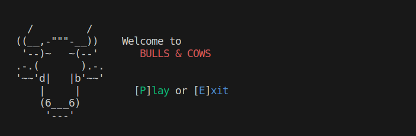

# Bulls and Cows

## Introduction

Welcome to "Bulls and Cows", a captivating game of deduction that combines strategy and chance. Developed with JavaScript, this game runs directly in your console and offers three levels of difficulty: Easy, Medium, and Difficult. Regardless of your experience level, "Bulls and Cows" promises an engaging and intellectually stimulating gaming experience.

## Prerequisites

Before you can start playing, you need to install `readline-sync`. This package is essential for the game's interaction with the console. To install it, open your terminal and run:
bash npm install readline-sync

Ensure you have Node.js installed on your system. If you haven't installed Node.js yet, you can download it from [Node.js official website](https://nodejs.org/).

## Getting Started

With `readline-sync` installed, follow these steps to launch the game:

1. Navigate to the directory where you downloaded the game files.
2. Start the game by running `node index.js`.

## Gameplay

Your adventure begins with a personalized greeting message. You'll be asked to input your name; if you prefer not to, you'll be identified as "Guest" throughout the game.

### Levels

"Bulls and Cows" includes three levels of increasing difficulty:

- **Easy**: Ideal for newcomers or those seeking a leisurely gaming session.
- **Medium**: Offers a steeper challenge, suitable for intermediate players.
- **Difficult**: Designed for experienced players, this level tests your guessing abilities to the fullest.

### Rules

The objective is to accurately predict a four-digit number composed exclusively of unique digits. Each incorrect guess receives feedback indicating how close you are to the correct answer:

- **Bulls**: Represents digits that are present in the correct position and match the guessed digit.
- **Cows**: Indicates digits that are part of the secret number but positioned incorrectly.

For instance, if the secret number is `1234` and you guess `1122`, you'd receive 1 bull (for the `2`) and 2 cows (for the `1`s).

### Progress Tracking

Each round concludes with a summary of your performance, detailing:

- The level played.
- The current game number (e.g., 1st game, 2nd game, etc.).
- The total number of attempts made thus far.

Upon completion, you'll be addressed as either "Guest" or by your chosen name, signifying the conclusion of your gaming session.

## Conclusion

Whether you're new to "Bulls and Cows" or a returning enthusiast, we hope you find the strategic challenges and engaging gameplay rewarding. Enjoy your guessing journey, and may fortune favor your efforts!

## Contact

Should you have any questions, suggestions, or need assistance, feel free to reach out.

## Preview

